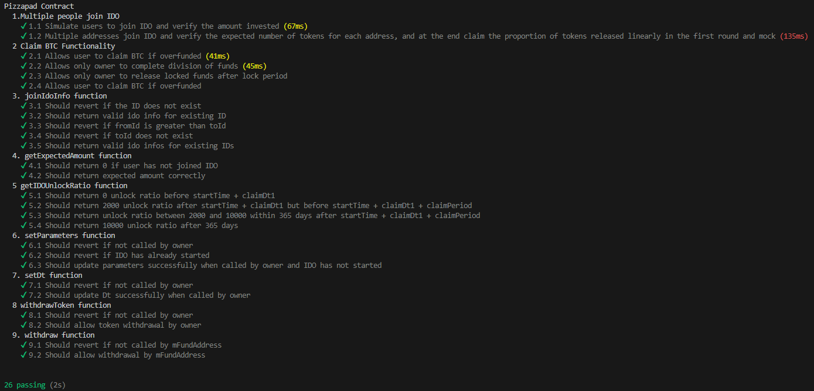
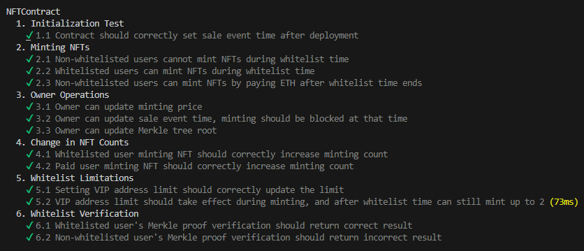

Here's a revised README tailored to the PlayFi project, with a mention of Merlin for the track:

---

# PlayFi

## Overview
This repository contains smart contracts for the **PlayFi PublicSale** project, developed as part of the Merlin Chain Prize track. The smart contracts facilitate the public sale of tokens through an Initial DEX Offering (IDO) mechanism. The test cases provided in this repository cover various functionalities of the PlayFi PublicSale contract, including participating in the IDO, claiming tokens, refunding overfunded amounts, and withdrawing funds.

## Test Cases Summary
1. **Initialization and Deployment**
    - Deployed the GLDToken and PlayFi PublicSale contracts.
    - Set parameters for the IDO, including join price, reward amount, and fund address.
    - Transferred tokens from GLDToken to PlayFi PublicSale.

2. **Multiple Participation in IDO**
    - Tested multiple user participations in the IDO.
    - Verified that users can join the IDO multiple times and checked the expected token amounts.

3. **Claiming Tokens**
    - Tested the functionality of claiming tokens after participating in the IDO.
    - Set claim time after the IDO ends and ensured users can claim tokens successfully.

4. **Refunding Overfunded Amounts**
    - Validated the process of users claiming refunds in case of overfunding during the IDO.
    - Checked the decrease in GLDToken balance after refunding.

5. **Withdrawing Funds**
    - Tested fund address withdrawal and owner withdrawal of ERC20 tokens.
    - Ensured the fund address can withdraw funds successfully and verified the ERC20 token balance after owner withdrawal.

## Installation Instructions
To set up and run the tests locally, follow these steps:

1. **Install Dependencies**
    - Run `npm i --force` to install the necessary dependencies.

2. **Start Local Node**
    - Start a local node by running `npx hardhat node`.

3. **Run Tests on Localhost**
    - Execute tests on the local network by running `npx hardhat test --network localhost`.
    - Examples:
        - `npx hardhat test --network localhost test/dap_nft.js`
        - `npx hardhat test --network localhost test/ai_starter_v2.js`
        - `npx hardhat test --network localhost test/new_starter.js`
        - `npx hardhat coverage`
        - `npx hardhat coverage --testfiles test/ai_starter_v2.js`
        - `npx hardhat test --network localhost test/private_fund.js`
        - `npx hardhat test --network localhost test/public_fund.js`
        - `npx hardhat test --network localhost test/fund_six_lock.js`
        - `npx hardhat test --network MerlinTestnet script/deploy-nftdemo.js`
        - `npx hardhat test --network localhost test/zklink_nft.js`

By following the above steps, you can deploy the contracts, run the test cases, and ensure the functionality of the PlayFi PublicSale smart contract.

This project was developed for the Merlin Chain Prize track, emphasizing innovation within the Merlin Chain ecosystem.

---

This README now reflects your PlayFi project with the necessary adjustments for the Merlin track.